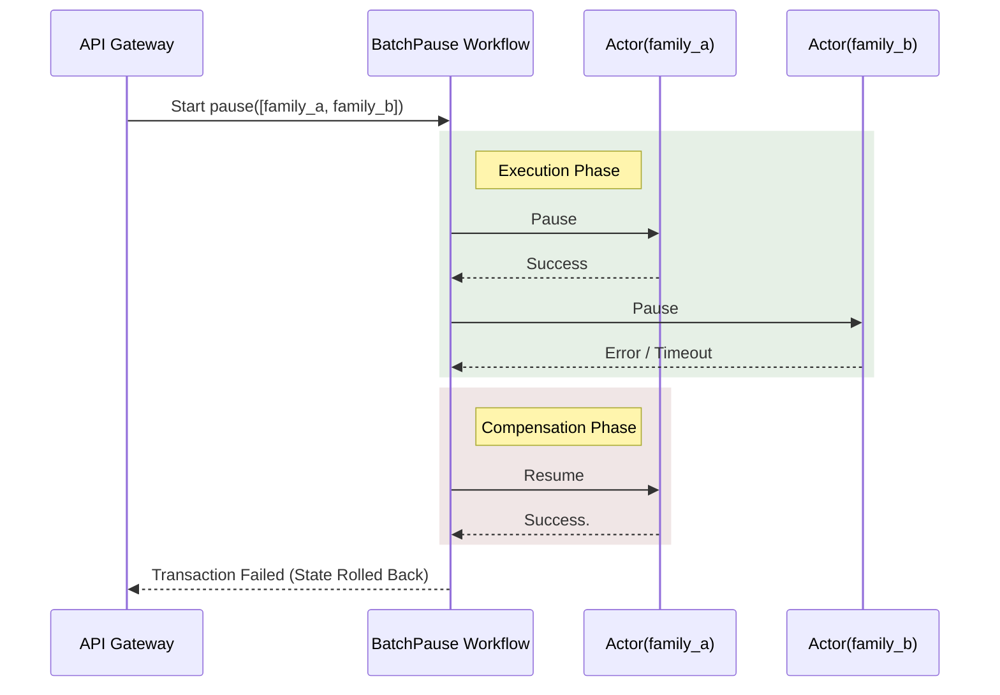
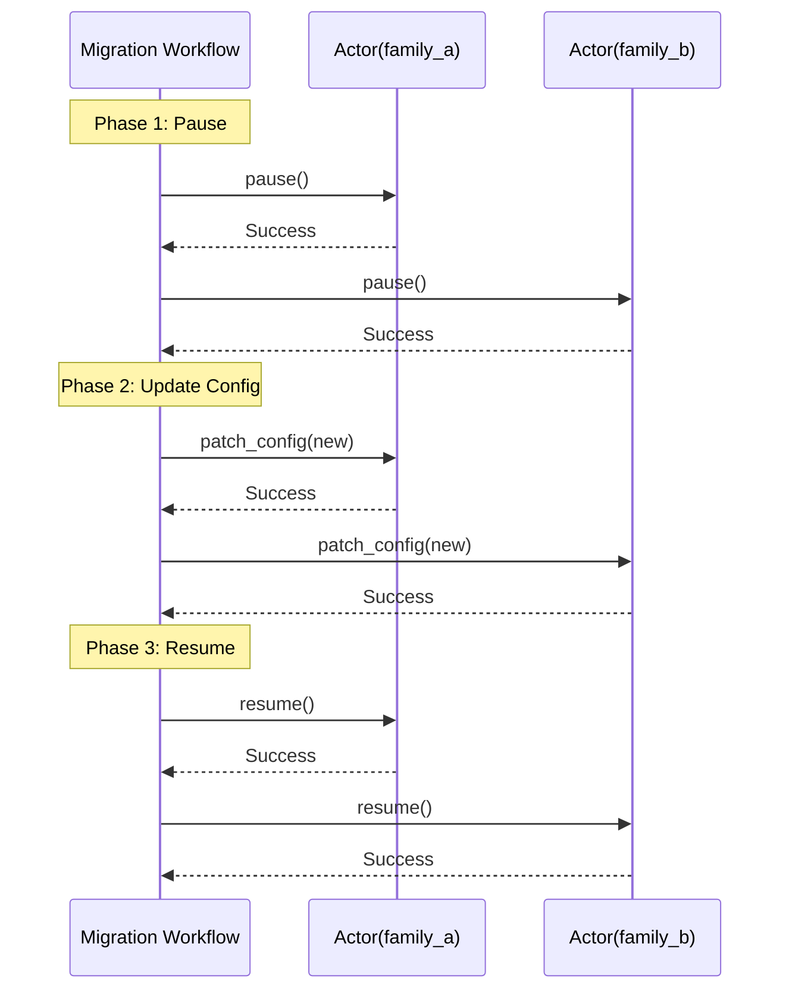
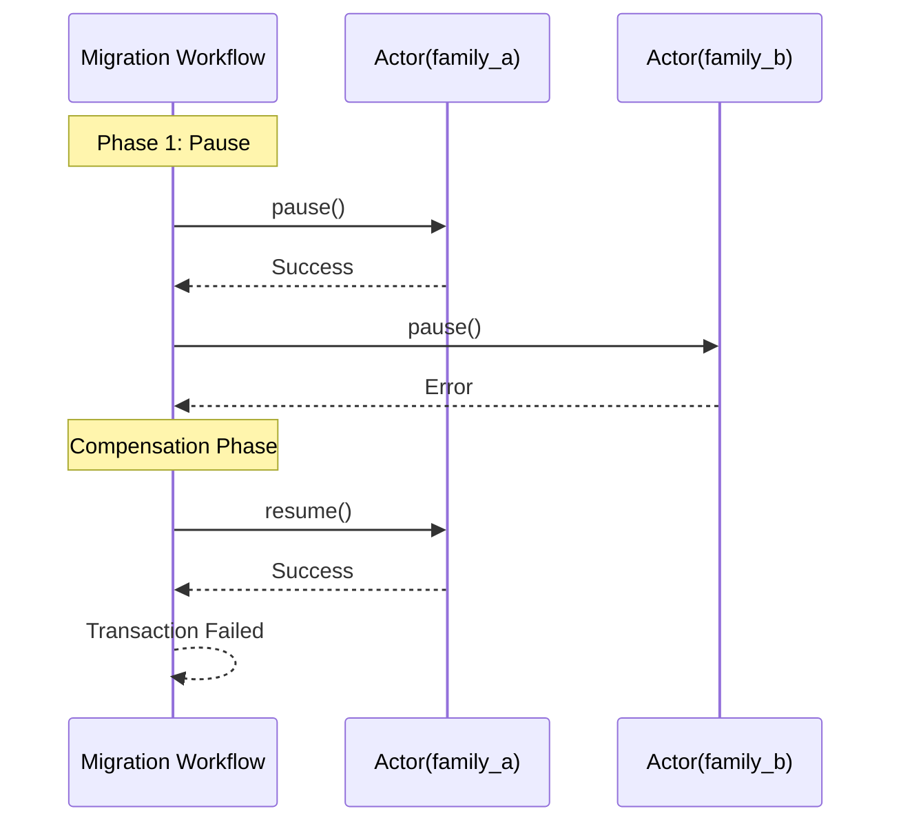
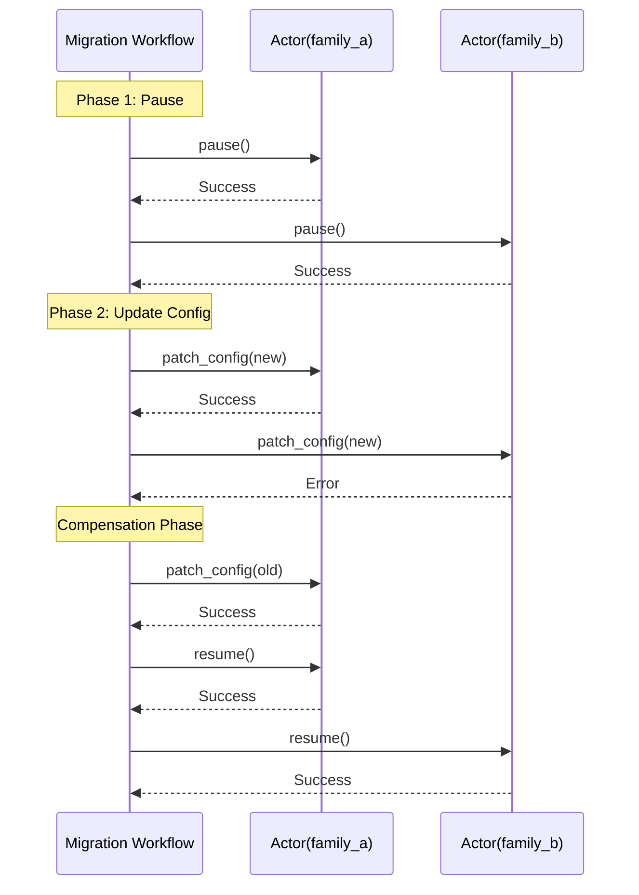
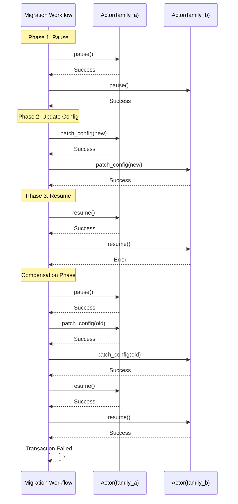

# RFC: Sink Layer Control Plane Architecture

A Request for Comments (RFC) is a "think before we build" document used to align the team on architecture, system boundaries, and technical trade-offs before we commit to writing any code. It is not a finalized mandate, but rather a formal proposal outlining a specific problem and the potential solutions. By defining our approach abstractly first, we ensure cross-functional visibility across teams, prevent isolated decision-making, and create a lasting historical record of exactly why we chose a specific path.

The most crucial part of an RFC is the "Comments" and we need your active, critical feedback before the review period closes. Please read through the document and leave comments directly on the page to ask clarifying questions, point out overlooked edge cases, or challenge the trade-offs being proposed. The goal is to surface disagreements and catch mistakes right now-when they are cheap to fix in text-so that once this RFC is officially approved, we can build the solution with high confidence and maximum speed.

**Depends on:** RFC: Datatype Onboarding Workflow
**Status:** PROPOSED
**Start Date:** 28 Jul 2026 **End Date:** 01 Jan 2027
**Author:** Nilton Guedes Duarte
**Reviewer(s):**
- Processing (Placeholder)
- Infra (Placeholder)
- S1 (Placeholder)

## Objective
Define architecture for Sink Layer Control Plane. Edge-deployed orchestration service synchronizes desired configuration states from Ingestion Config Portal to local Flink jobs. System must be resilient to crashes, handle complex multi-step orchestrations, and guarantee eventual consistency back to the Ingestion Config Portal.

## Core Technology Selection
**Language: Python**
Matches team expertise, ensuring language familiarity. Drives primary solution selection.

**Orchestration: Durable Execution Engine**
Produces maintainable code. Avoids complex state machines in favor of workflows integrated directly into application code. Natively handles retries, rollbacks, and sequential executions across distributed systems. Allows workflows to pause indefinitely for external signals/calls without consuming compute threads. Approved frameworks include DBOS, Restate and Temporal. PoCs will evaluate each framework.

### Temporal
The industry standard for microservice orchestration and distributed sagas. It separates application code from state management.
- License: MIT License. Free for enterprise.
- Kubernetes Deployment: Official Helm charts. Requires deploying multiple microservices (Frontend, Matching, History, Worker) plus a datastore (PostgreSQL or Cassandra). High resource footprint.
- Community: 12.2k GitHub Stars.
- Stability: Available since 2019 (forked from Uber's Cadence, built in 2017). Highly mature.
- Integration: Native Python SDK (temporalio). Fully code-integrated.
- Repository: temporalio/sdk-python

### Restate
A code-first distributed execution engine built on Rust. It uses HTTP/2 for communication, resulting in a very low resource footprint.
- License: BSL/Apache 2.0. Free for internal deployment.
- Kubernetes Deployment: Single binary deployment. Requires no external database (uses local RocksDB).
- Community: ~4k GitHub Stars.
- Stability: Stabilized in 2023. Fast adoption, but lower maturity than Temporal.
- Integration: Native Python SDK. Fully code-integrated.
- Repository: restatedev/restate
> Note on Flink and Restate relationship: Restate was founded by the creators of Apache Flink, directly applying lessons learned from Flink's StateFun (Stateful Functions) API. It adapts stream processing resilience (event sourcing and durable state) to asynchronous microservices orchestration.

### DBOS (Database-Backed Operating System)
A code-first Python library implementing durable execution directly on PostgreSQL.
- License: MIT License. Free for enterprise use.
- Kubernetes Deployment: Standard Python application pod deployment. Requires only a PostgreSQL connection, eliminating external orchestration servers.
- Community: Open-source project launched recently. Rapidly growing community.
- Stability: Available since 2024.
- Integration: Native Python library (dbos-transact-py). Exceptional fit. Workflows and state transitions execute within database transactions, providing minimal infrastructure overhead.
- Repository: dbos-inc/dbos-transact-py

## System Architecture & Components
Control plane acts as intermediary between central Ingestion Config Portal and local Kubernetes cluster running Flink.
- **Reconciliation Loop:** Queries Ingestion Config Portal for target configuration and triggers execution workflows upon delta detection.
- **Persistent Workflow Engine:** Chosen durable execution framework automatically persists execution phases. Framework natively replays workflows from the last completed step upon crash recovery, abstracting state management from the control plane.
- **External Operational Web API:** Exposes HTTPS endpoints for engineers to manually trigger workflows (such as stopping a job).
- **Kubernetes Mutator:** Translates workflow steps into Kubernetes API calls. Updates ConfigMap and triggers state changes for native Flink Kubernetes Operator.

### Workflows
For the MVP, we focus on implementing the following workflows:
- **Stop Jobs:** Terminate running applications cleanly using savepoints.
- **Resume Jobs:** Restore halted applications to active state.
- **Move Datatype Between Jobs:** Reassign topic processing ownership between applications. Trigger Move Datatype Between Jobs if needed.
- **Reconcile Configuration:** Resolve state drift between desired configurations and runtime states.

The following are not planned or requested, they are here for a broad discussion to get a better picture of possibilities:
- Automated Failure Recovery: Resolve unrecoverable process hangs by forcing restarts from checkpoints.
- Savepoint Lifecycle Management: Schedule savepoints and prune expired files.
- Throughput Tier Transition: Migrate job families across capacity tiers based on traffic peaks.
- Evaluate Health and Performance: Aggregate telemetry signals.
- Deploy and Upgrade Application: Manage version rollouts via savepoint and restore operations.

We will use Virtual Objects (or Actors, names varies between tools) to maintain consistency for each job family, avoiding conflicting workflow executions on the same resource.

### Service types comparison

| | Basic Service | Virtual Object | Workflow |
|---|---|---|---|
| **What** | Independent stateless handlers | Stateful entity with a unique key | Multi-step processes that execute exactly-once per ID |
| **State** | None | Isolated per object key | Isolated per workflow instance |
| **Concurrency** | Unlimited parallel execution | Single writer per key (+ concurrent readers) | Single run handler per ID (+ concurrent shared handlers) |
| **Key Features** | Durable execution, service calls | Built-in K/V state, single-writer consistency | Workflow promises, shared handlers, lifecycle management |
| **Best For** | ETL, sagas, parallelization, background jobs | User accounts, shopping carts, agents, state machines, stateful event processing | Approvals, onboarding workflows, multi-step flows |

Actors mimicks a queue per object key (job family).
Source: https://docs.restate.dev/foundations/services

### Virtual Objects/Actors
**FlinkJobFamilyActor:** Keyed by `job_family`. Guarantees strict sequential execution per family. Queues concurrent commands implicitly (e.g., Resume blocks until active Update finishes). Maintains internal state, eliminating external database dependency for state resolution.

### Activities
Atomic, idempotent interactions with the Kubernetes API. Executed within the actor context.
- **Trigger Savepoint(job_family):** Patches FKO resource. Polls status until savepoint URI is written.
- **SuspendJob(job_family):** Patches FKO resource state to SUSPENDED. Polls status until reached.
- **ResumeJob(job_family):** Patches FKO resource state to RUNNING. Polls status.
- **PatchConfigMap(job_family, config_data):** Updates routing ConfigMap payload. Returns previous config state for rollback.

### Virtual Actor Handlers
Internal actor logic executed sequentially per `job_family`.
- **Pause:** Verify state != SUSPENDED. Execute Trigger Savepoint. Execute SuspendJob.
- **Resume:** Verify state != RUNNING. Execute ResumeJob.
- **PatchConfig:** Execute Pause handler. Execute PatchConfigMap. Execute Resume handler.

### Saga Workflows (All-or-Nothing Orchestrators) – Fail‑Fast Policy
The control plane adopts a **fail‑fast** compensation model: as soon as any step in a saga fails, the workflow aborts and immediately triggers compensating actions for all steps that have already succeeded. This guarantees all‑or‑nothing semantics with minimal extra processing.
- **Batch Pause Workflow:** Executes `Pause` on each targeted actor; on first error, immediately issues `Resume` for any actors that were already paused.
- **Batch Resume Workflow:** Executes `Resume` on each targeted actor; on first error, immediately issues `Pause` for any actors that were already resumed.
- **Batch Update Workflow:** Executes `PatchConfig` on each targeted actor; on first error, immediately reverts the configuration of any actors that were already updated and issues `Resume` to restore their runtime state.

### Testing Scope
Add a suite of unit tests for the Temporal.io implementation that exercise each failure scenario using Temporal's **workflow replay** capability. Tests will:
- Simulate failures in the Pause, Update, and Resume phases.
- Verify that the fail‑fast compensation logic is invoked correctly.
- Replay the workflow from the persisted state to ensure deterministic recovery.
- Use the Temporal test server (`temporalite`) to run fast, in‑process tests without external services.

## Sequence Diagrams - Failure Scenarios & Compensations

### 1. Saga Compensation: Batch Pause Failure
Shows all-or-nothing rollback when an actor fails during a batch operation.

### 2. Saga Compensation: Datatype move
1. Success: Happy path
2. Failure in Pause: One job family pauses, the next fails.
   • Compensation: Resume the successfully paused families. State remains unchanged.
3. Failure in Update: Both families pause. One updates config, the next fails.
   • Compensation: Revert config for updated families. Resume all paused families.
4. Failure in Resume: Both pause, both update. One resumes, the next fails.
   • Compensation: Pause the successfully resumed families. Revert config for all families. Resume all families to restore initial operational state.

#### 1. Successful Migration

#### 2. Failure in Pause Phase

#### 3. Failure in Update Phase

#### 4. Failure in Resume Phase

## Python Reliability
### Language Type Safety Constraints
Python lacks compile-time type enforcement. Dynamic runtime execution creates risk of unhandled type errors inside edge orchestration workflows.

#### Mandatory MVP Strict Type Checking
To minimize runtime failures during the MVP phase, the codebase must enforce static type safety during development.
- Require full static type coverage using strict analyzer configurations (such as `pyright-strict` or `mypy --strict`).
- Explicitly annotate all function signatures, operational parameters, and class attributes.
- Disallow implicit `Any` types, unhandled `None` returns, and dynamic runtime modifications.
- Use type aliases and generic parameters to clearly communicate domain models across modules.
- Make extensive use of `dataclasses` and `Pydantic` to communicate domain models. Avoid structures such as dictionaries to store well-known data.

### AI-Native development
The Python MVP serves as a working specification to validate domain logic, retry behaviors, and durable execution patterns. It functions as an onboarding vehicle to familiarize the team with durable execution engine tools and architectural patterns such as Saga.
Upon MVP validation, evaluate moving the control plane to a natively compiled, statically typed language (such as Kotlin/Java or Go). Leverage an AI assistant to translate the MVP codebase, preserving validated workflow logic while gaining compile-time type guarantees.

AI coding assistants perform better in strictly typed languages:
- Types act as formal specifications, reducing ambiguity.
- Type definitions provide exact context for data structures.
- Feeding compiler errors back to the assistant enables an autonomous repair loop.
- Compilers provide exact failure points for type mismatches, unbound variables, and non-exhaustive matches.
- Structured compiler errors direct the model to local repairs, preventing context exhaustion.
- Errors are resolved at compile time before execution.
- Feature-driven folder structures optimize AI context retrieval. Models target specific domains, avoiding full-codebase scans.
> AI code assistant development evolves rapidly. Reassess this guideline in the future.

### Polyglot Durable Execution
Durable execution engines separate orchestration state from application compute. This architecture natively supports polyglot environments. Multiple programming languages co-exist within the same control plane.

### Co-Living Workflows
The Python MVP serves as the initial entry point. Upon validating domain models and orchestration patterns, developers evaluate introducing new workflows utilizing strictly typed languages.
- Interoperability: Python workflows trigger workflows or activities written in different languages using the durable execution framework API.
- Gradual Adoption: Build subsequent workflows in the new language. MVP workflows continue operating concurrently.

### AI Translation Strategy
Leverage artificial intelligence tools to accelerate cross-language development.
- Translate Python Pydantic domain models into target language structures to ensure exact schema parity.
- Generate boilerplate code for registering and invoking cross-language workflows.
- Use existing Python MVP workflows to kickstart new workflows in the target language.

## Alternatives Considered
Non-Python languages and non-durable orchestrations rejected during architectural review.

### Frameworks & Architecture Options
- **Orkes (Netflix Conductor):** Relies on JSON definitions, violating strict code-first requirement.
- **Distributed Workflow Engines:** Argo Workflows, Camunda. Rejected due to YAML-heavy orchestration evolving into unmaintainable pseudo-code.
- **Custom State Machine:** Procedural code utilizing local database. Rejected because of high complexity.

### Rejection of Kubernetes Operators
- Kubernetes Operators excel at declarative state reconciliation for single resources.
- Operators struggle with imperative, multi-step runbooks.
- Building distributed sagas inside an Operator requires complex, custom state machines.
- Creates steep learning curve for MVP.